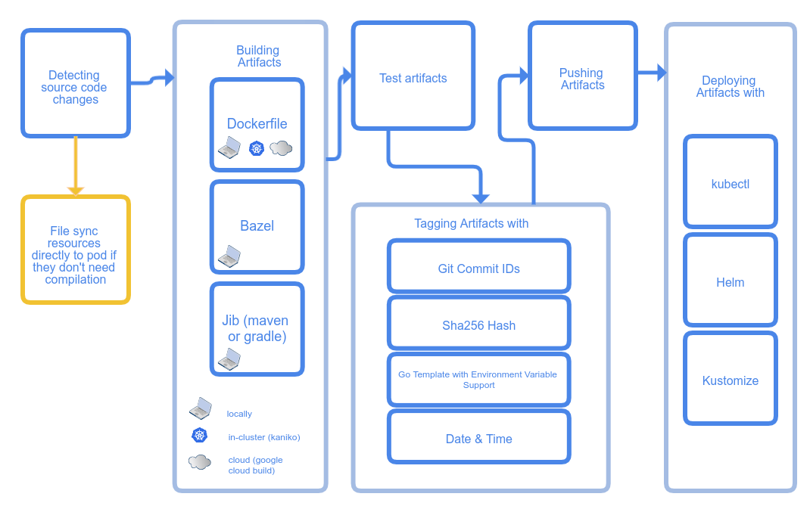

# 简介
Skaffold是一个命令行工具，可促进Kubernetes应用程序的持续开发。您可以在本地迭代应用程序源代码，然后部署到本地或远程Kubernetes集群。Skaffold处理构建，推送和部署应用程序的工作流程。它还提供了构建块并描述了CI / CD管道的自定义项。

1. 收集并监视您的源代码以进行更改
2. 如果用户将文件标记为可同步，则将文件直接同步到Pod
3. 从源代码构建 artifacts
4. 使用容器结构测试来测试构建的 artifacts
5. 标记 artifacts 
6. 推送 artifacts
7. 部署 artifacts
8. 监视部署的 artifacts
9. 在退出时清理部署的 artifacts（Ctrl + C）

Skaffold 支持以下工具：
* Build
    - 本地 Dockerfile
    - 集群内 kaniko 构建
    - 谷歌云上构建
    - 本地 Bazel
    - 本地 Jib Maven/Gradle
* Test
    - 容器结构测试
* Tag
    - tag by git commit 
    - tag by current date&time
    - tag by environment variables based template
* Push
    - 不推送，保留image在本地
    - 推送至远程仓库
* Deploy
    - Kubectl
    - Helm
    - Kustomize
    
除上述步骤外，skaffold还将自动为您管理以下实用程序：
- 使用以下命令将容器端口转发到本地计算机 kubectl port-forward
- 汇总来自已部署Pod的所有日志
